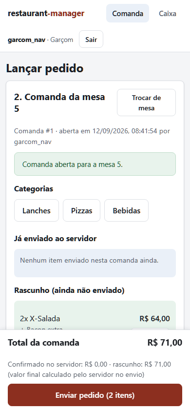

Restaurant Manager
## Histórico

Projeto iniciado em 2025 e atualizado em 2026, com melhorias nas
funcionalidades, testes e documentação.

Sistema web de mesas e comandas, do pedido do garçom ao fechamento no caixa.

Projeto de portfólio desenvolvido em Python e Django, com interface para celular e desktop, catálogo de produtos, adicionais, pagamentos manuais e histórico de atendimentos. A proposta parte da minha experiência em gestão de restaurante e transforma necessidades do salão em regras de software.

Funcionalidades · Executar localmente · Decisões técnicas · Testes · Autor

O problema que o projeto resolve

Uma comanda precisa continuar correta quando o cliente pede outra rodada, outro garçom assume a mesa ou o caixa encerra o atendimento. O sistema centraliza os pedidos e seus valores, mantém os itens já enviados separados do rascunho e registra quem realizou as principais operações.

O fluxo principal é:

O garçom abre uma mesa e seleciona os produtos, adicionais e observações.

O servidor valida o pedido, calcula os preços e grava os itens.

O caixa acompanha as comandas com atualização a cada 10 segundos.

O operador registra o pagamento manual e encerra a comanda.

A mesa é liberada e o consumo permanece no histórico.

Funcionalidades

Área

O que está implementado

Cardápio

Produtos por categoria, disponibilidade, imagens opcionais e adicionais; consulta pública do catálogo.

Garçom

Abertura de mesa, rascunho de pedido, quantidades, observações e envio de novas rodadas.

Pizzas

Seleção de dois sabores e regra configurável de preço: maior valor ou média.

Caixa

Visão das mesas, detalhes da comanda, atualização periódica e cancelamento de itens com motivo.

Pagamento

Registro manual de dinheiro, Pix, débito ou crédito; cálculo de troco em dinheiro e encerramento da comanda.

Histórico

Consulta por período, mesa e situação, com valores e responsáveis registrados.

Administração

Cadastros de produtos, adicionais, mesas e usuários pelo Django Admin.

Acesso

Perfis de garçom, caixa e administração, com permissões verificadas no servidor.

Telas do sistema

Garçom: montagem de uma rodada no celular

Ver pagamento e histórico

Registro manual de pagamento e troco

Histórico de atendimentos

As capturas usam dados fictícios. O teste de navegador em apps/atendimento/tests/test_navegador.py contém o fluxo que gera as imagens em docs/capturas/.

Decisões técnicas

Problema

Solução no projeto

Código de referência

O navegador pode enviar um preço adulterado

A entrada recebe IDs, quantidades e escolhas; o servidor consulta o catálogo e calcula os valores.

Formulários e serviços

Uma tentativa de envio pode ser repetida após falha de rede

Cada envio possui UUID com restrição única. A repetição da mesma referência reutiliza o registro anterior.

Serviços

Duas comandas abertas para a mesma mesa causam inconsistência

Uma restrição condicional no banco limita a mesa a uma comanda aberta.

Modelos

Alterar o catálogo não pode mudar contas anteriores

Os itens preservam descrição, preço unitário e adicionais praticados na venda.

Modelos

Valores monetários exigem uma regra consistente

Cálculos com Decimal, duas casas decimais e arredondamento definido em um módulo próprio.

Valores

Pagamento e encerramento precisam permanecer consistentes

As duas operações ficam na mesma transação; o pagamento possui relação um para um com a comanda.

Serviços

Ocultar um botão não impede acesso ao endpoint

As operações verificam o perfil no servidor e usam proteção CSRF nas mutações.

API e perfis

Essas decisões são verificadas por testes de regras de negócio, permissões e persistência. Restrições de banco não substituem testes de concorrência entre processos; essa validação permanece uma limitação da versão atual.

Organização do código

Componente

Responsabilidade

apps.cardapio

Categorias, produtos, adicionais e disponibilidade.

apps.atendimento

Mesas, comandas, envios, itens e pagamentos.

apps.clientes

Página pública do estabelecimento.

models.py

Entidades, relacionamentos e restrições de persistência.

formularios.py

Validação das entradas.

servicos.py

Operações de negócio e transações.

api.py e views.py

Endpoints JSON, autorização e apresentação das telas.

static/js/

Interações do navegador e comunicação HTTP.

A implementação utiliza recursos nativos do Django, incluindo modelos, formulários, autenticação e classes reutilizáveis. A orientação a objetos aparece, por exemplo, na classe abstrata de campos comuns, nos querysets do catálogo e nas exceções de negócio.

Mais detalhes em Arquitetura e decisões.

Stack

Back-end: Python 3.11+, Django 5.2 e Django ORM.

Front-end: HTML, templates Django, CSS próprio e JavaScript sem framework.

Banco de dados: SQLite.

Configuração e arquivos: python-decouple, Pillow e WhiteNoise.

Qualidade: testes do Django, Playwright, Ruff e workflow de GitHub Actions.

As dependências de execução estão fixadas em requirements.txt. As ferramentas de desenvolvimento estão em requirements-dev.txt.

Executar localmente

Windows

Requer Python 3.11 ou superior e Git. Os comandos abaixo são para o Prompt de Comando (CMD), inclusive quando aberto no terminal do VS Code.

git clone https://github.com/engRafaelMateus/projeto_restaurante.git
cd projeto_restaurante
python -m venv .venv
.venv\Scripts\python.exe -m pip install -r requirements-dev.txt
if not exist .env copy .env.example .env

Gere uma chave local com o comando abaixo, copie o resultado e substitua o valor de DJANGO_SECRET_KEY no arquivo .env:

.venv\Scripts\python.exe -c "from django.core.management.utils import get_random_secret_key; print(get_random_secret_key())"

Mantenha DJANGO_DEBUG=True para a demonstração local. Em seguida, execute nesta ordem:

.venv\Scripts\python.exe manage.py migrate
.venv\Scripts\python.exe manage.py seed_demo
.venv\Scripts\python.exe manage.py runserver

O migrate cria as tabelas. O seed_demo cadastra produtos, mesas e usuários fictícios; ele deve ser executado somente depois das migrações. Se um comando falhar, resolva o erro antes de continuar.

Se houver vários Pythons instalados, use o caminho completo da instalação escolhida no comando de criação do ambiente. Os demais comandos já usam o Python da .venv, sem necessidade de ativação manual.

Linux e macOS

git clone https://github.com/engRafaelMateus/projeto_restaurante.git
cd projeto_restaurante
bash scripts/setup.sh
.venv/bin/python manage.py runserver

O script prepara o ambiente, gera a configuração local quando ausente, aplica migrações e carrega os dados fictícios. Um .env existente é preservado.

Acessos e contas de demonstração

Abra http://127.0.0.1:8000/entrar/. A senha inicial dos usuários criados pelo seed_demo é demo12345.

Usuário

Perfil

Tela principal

garcom e garcom2

Garçom

/atendimento/comanda/

caixa

Caixa

/atendimento/caixa/

gerente

Administração

/admin/

Essas contas são destinadas à demonstração local. O comando não redefine a senha de um usuário que já exista. O histórico está em /atendimento/historico/, conforme a permissão do usuário.

Demonstração em poucos minutos

Entre como caixa em uma janela normal e como garcom em uma janela anônima.

No garçom, abra a mesa 5 e adicione produtos com uma observação.

Envie a rodada e acompanhe a atualização na tela do caixa.

Adicione outra rodada; recarregue a página para conferir a persistência dos itens enviados.

No caixa, registre um pagamento em dinheiro e confira o troco.

Consulte o histórico e abra uma nova comanda na mesma mesa.

Testes

Verificação local em 12/09/2026: Python 3.12 e Django 5.2.17, em Linux. A suíte descobriu 91 testes: 89 executaram e passaram; os 2 testes de navegador ficaram pulados. As checagens do Django, consistência das migrações, migração em banco novo, carga de demonstração repetida e Ruff também passaram. A execução no navegador não foi validada nesta revisão porque o download do Chromium falhou.

No Windows, use o Python do ambiente criado:

.venv\Scripts\python.exe manage.py check
.venv\Scripts\python.exe manage.py makemigrations --check --dry-run
.venv\Scripts\python.exe manage.py test
.venv\Scripts\python.exe -m ruff check .

A suíte cobre preços, quantidades inválidas, permissões, repetição de envios, cancelamentos, restrições do banco, pagamento e preservação do histórico. Os testes usam banco separado da demonstração.

Testes no navegador

Exigem instalar o Chromium usado pelo Playwright. No CMD:

.venv\Scripts\python.exe -m playwright install chromium
set RODAR_TESTES_DE_NAVEGADOR=1
.venv\Scripts\python.exe manage.py test apps.atendimento.tests.test_navegador
set RODAR_TESTES_DE_NAVEGADOR=

No Linux/macOS:

.venv/bin/python -m playwright install chromium
RODAR_TESTES_DE_NAVEGADOR=1 .venv/bin/python manage.py test apps.atendimento.tests.test_navegador

Sem a variável de ambiente, os testes de navegador são pulados. O fluxo utiliza sessões independentes para garçom e caixa e gera as capturas utilizadas neste README.

O workflow de verificação está configurado para checagens do Django, migrações, carga de demonstração, arquivos estáticos, testes e lint. O resultado de uma execução remota deve ser consultado na aba Actions; a existência do workflow não significa que o CI já passou.

Escopo e limitações

Um estabelecimento por instalação, com demonstração local em SQLite.

A validação de concorrência com processos simultâneos ainda não foi realizada. PostgreSQL não está configurado nem declarado como validado.

O pagamento é um registro manual: não confirma transações externas de Pix ou cartão.

A conta é liquidada integralmente. Pagamento parcial/dividido, descontos, taxa de serviço e estorno não estão implementados.

O cardápio público é de consulta; não há checkout de delivery nesta versão.

Estoque, emissão fiscal, impressora de cozinha e integração bancária estão fora do escopo.

O projeto demonstra desenvolvimento de software e regras de negócio. Para operação comercial ou hospedagem pública, ainda são necessários configuração de implantação, revisão das contas de acesso e validação do ambiente de uso.

Próximas evoluções

Validar concorrência em PostgreSQL antes de oferecer suporte a esse banco.

Implementar pagamentos divididos e descontos com regras explícitas.

Evoluir relatórios de vendas e integração com a cozinha.

Autor

Rafael Lopes Mateus — formado em Engenharia da Computação, com experiência em gestão de restaurante e interesse em desenvolvimento de software e sistemas embarcados.

GitHub · LinkedIn · E-mail
